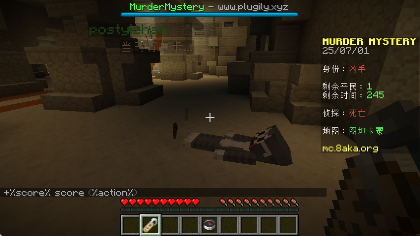

简体中文 | [English](README_EN.md)

<div align="center">

# 🔪 MurderAddon

**为 MurderMystery 游戏添加尸体生成功能的附属插件**

[](https://minecraft.net)
[](https://openjdk.org)
[](https://kotlinlang.org)



</div>

---

## 📋 系统需求

| 组件 | 版本要求 |
|------|----------|
| **Minecraft** | 1.20+ |
| **Java** | 21+ |
| **服务端** | Spigot/Paper |

## 📦 依赖插件

- [**Adyeshach**](https://github.com/TabooLib/adyeshach) - NPC 实体管理
- [**MurderMystery**](https://github.com/Plugily-Projects/MurderMystery) - 主游戏插件

## 🚀 安装步骤

### 1️⃣ 安装依赖
首先安装必需的前置插件：
- 下载并安装 [Adyeshach](https://github.com/TabooLib/adyeshach)
- 下载并安装 [MurderMystery](https://github.com/Plugily-Projects/MurderMystery)

### 2️⃣ 安装插件
将 `MurderAddon.jar` 放入服务器的 `plugins` 文件夹

### 3️⃣ 配置 MurderMystery
在 MurderMystery 配置中**关闭**原生尸体功能：

```yaml
# plugins/MurderMystery/config.yml
Last-Words:
  Enable: true          # 保持启用亡语系统
  Show-Hologram: true   # 保持显示全息文字
  Show-Corpse: false    # ❌ 关闭原生尸体显示
```

### 4️⃣ 重启服务器
重启服务器以加载所有插件

---

## 🎮 使用方法

插件安装后会自动工作，无需额外操作。当玩家在 MurderMystery 游戏中死亡时，会自动生成对应的尸体。

### 管理命令

```
/murderaddon reload  - 重新加载配置
/murderaddon info    - 查看插件信息
```

**权限节点：** `murderaddon.admin`

---

<div align="center">

**🎯 让你的 MurderMystery 游戏更加真实！**

</div>
